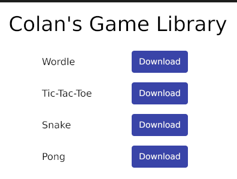

# My Game Library



Hi, this is a tool to make it easy to download and play my games. I currently only support MacOS and Windows, but will, one day, support Linux. I recommend downloading from the releases if you are interested.

## Building Locally

```
go run main.go
```

## Building a Release

```
go install gioui.org/cmd/gogio@latest
```

Then you can build:

```
./make_release.sh
```
